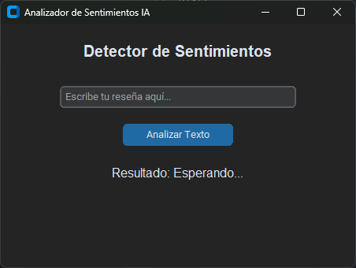
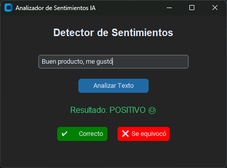
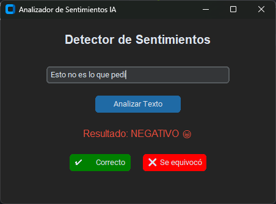

# 🧠 Analizador de Sentimientos IA (Local)

Una aplicación de escritorio moderna construida en Python que utiliza Inteligencia Artificial (Procesamiento de Lenguaje Natural) para analizar texto y determinar si el sentimiento es **Positivo** o **Negativo**.

## ✨ Características Principales

* **Análisis en Tiempo Real:** Interfaz gráfica intuitiva para evaluar textos al instante.
* **Modelo de Machine Learning:** Utiliza el algoritmo `Naive Bayes Multinomial` para la clasificación de texto.
* **Feedback Loop (Aprendizaje Continuo):** El usuario puede corregir a la IA si se equivoca. Estas correcciones se guardan localmente en un archivo `.csv` y el modelo se reentrena automáticamente en la siguiente ejecución.
* **Privacidad de Datos:** Todo el procesamiento y el guardado de datos ocurre localmente en tu máquina.

## 🛠️ Tecnologías Utilizadas

* **Lenguaje:** Python 3.x
* **Machine Learning:** `scikit-learn` (CountVectorizer, MultinomialNB, Pipeline)
* **Interfaz Gráfica (GUI):** `customtkinter`
* **Manejo de Datos:** Módulo `csv` y `os` nativos de Python.

## 🚀 Cómo ejecutar el proyecto localmente

Sigue estos pasos para probar la aplicación en tu computadora:

1. **Clona este repositorio:**

2. **Crea y activa un entorno virtual (Recomendado):**
    ```bash
    python -m venv venv
    # En Windows:
    .\venv\Scripts\activate
    # En Mac/Linux:
    source venv/bin/activate
    ```

3. **Instala las dependencias necesarias:**
    ```bash
    pip install scikit-learn customtkinter
    ```

4. **Ejecuta la aplicación:**
    ```bash
    python main.py
    ```

## 📸 Capturas de Pantalla

<p align="center">
  
  
  
</p>